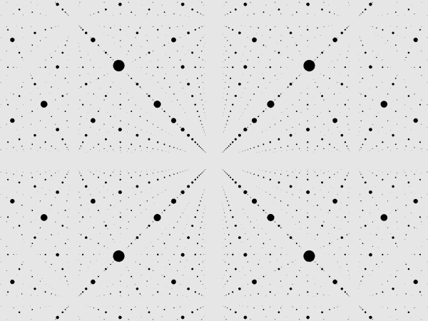
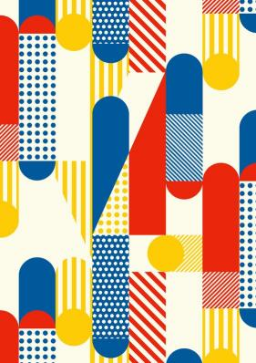

# 9103-tut01-qcui0299
## How to interact with the work
- The animation is driven by Perlin noise, so it starts automatically after the page has finished loading.
- The animation will respond to browser size changes and be centered, but for the best viewing experience, the recommended window size is between 700-1100. Excessive zooming in or out will affect the picture.
## Details of individual approach to animating the group code
### The way to drive personal code
- Using Perlin Noise to drive animation
### Animation property description
- Make the dot rectangle into a dynamic background: Move the dot rectangles in the image to the bottom layer, increase the number and direction, and create a dynamic background in the shape of a grid through animation.
- Transparency Pulse: The transparency of the shape is driven by Perlin noise, using the noise() function to make the transparency change smooth and natural, creating a breathing dynamic effect.
- Location Updates: Applies Perlin noise based position jitter with random values ​​to the circle only, simulating a slight "floating" effect.
- Size changes: Add a random resizing effect to the dot rectangle to give it a slight scaling effect.
### Uniqueness from other group members
- Sound: Her works use sound to drive the position of lines and the size of circles.
- Time:
- 
- The biggest difference from other members is that I transformed the dot rectangle into a homomorphic background, making the picture simulate the rhythm of Broadway.
## References to inspiration for animating individual code
 ### Image 1
 - 
https://jp.pinterest.com/pin/182536591122488157/
 - In this type of animation, the dots on a grid grow, shrink, or move in a rhythmic manner. This effect can be seen in many dynamic backgrounds, such as animations, music visualizations, or the dynamic grid effects of certain graphic design tools.The expansion and contraction of the dots looks like the grid is "breathing", creating a rhythmic feeling.
 ### Image 2
 - 

 https://au.pinterest.com/pin/design-studio--68741909701/
- This image inspired me to use a matrix of dots to create something different. The dotted rectangles combined with the Mondrian-style line and rectangle layout create an effect that feels both modern and dynamic.
### How did they affect my submissions
- These two concepts inspired me to animate the dotted rectangles into a rhythmic, homeomorphic background. By adding motion to the dotted elements, they are no longer just static shapes; they move in sync with the overall rhythm, simulating the pulsating energy of Broadway and reinforcing the grid structure, reminiscent of Mondrian's work.
## A short technical description of how the personal code can animate the image
- The updatePositions() and updateJumpingShapes() functions add Perlin noise and random value driven motion to specific shapes. For example, circular shapes float gently, and certain shapes, like the cateye, have multi-axis Perlin noise motion. 
- In updateSizes(), the point shapes are animated using random values ​​with sin(). This gradual resizing gives them a rhythmic "breathing" effect, enhancing the dynamic quality of the piece.
- Perlin noise also controls the opacity within show() for each shape, creating smooth, randomized opacity transitions that further enhance the natural and rhythmic qualities of the animation.
### Changes to the group code
- There are not many changes in the overall structure, but the main changes are the way to respond to the browser and the logic of drawing shapes. The number of dot rectangles in createArtwork() is increased and placed in the background.These changes are to better animate the image.
###  Technique from outside the course
- millis() is a function that returns the number of milliseconds since the program began running.
- millis() provides an increasing value of time, which can be used to control the noise input to adjust the speed of the animation. Each shape can generate a unique noise input based on its own coordinates and time, so that even shapes of the same type will have their own movement trajectory.